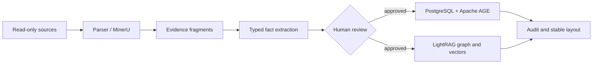

# Material Knowledge Graph

A focused, source-available snapshot of OmniMat's material knowledge-graph engineering pipeline.

This repository contains only the code required to discover and read sources, parse evidence, extract typed material facts, review graph mutations, persist approved data to PostgreSQL/Apache AGE and LightRAG, validate generation manifests, and build browser-safe layout assets.

> Public visibility does not grant an open-source license. OmniMat-owned code remains governed by the root `LICENSE`.

## Scope



Included:

- source catalog, selection, bounded remote reading, parsing, retention, and spool controls;
- evidence-to-entity/relation extraction with deterministic checkpoints;
- review records, outbox jobs, and approved AGE writes;
- LightRAG bindings, least-privilege validation, custom-KG bundles, portable embeddings, and admission;
- textbook corpus preparation, raw graph extraction, merge/import scripts, graph audit, and layout publication;
- PostgreSQL knowledge migrations and focused tests.

Excluded:

- LangGraph task execution and multi-agent orchestration;
- task-specific agent views, task subgraphs, literature expansion, and report synthesis;
- API/SSE run management, user interface, long-term agent memory, prediction, experiments, and managed compute;
- raw documents, generated vectors, runtime databases, credentials, and production server configuration.

## Quick start

```bash
python3 -m venv .venv
. .venv/bin/activate
python -m pip install --upgrade pip
python -m pip install -e '.[dev,rag,database]'
material-graph-knowledge --help
```

Validate public policies and bindings:

```bash
material-graph-knowledge verify-policy --help
material-graph-knowledge verify-bindings --help
material-graph-knowledge verify-runtime --help
```

Build the derived knowledge artifacts:

```bash
python scripts/extract_textbook_raw_graph.py --help
python scripts/build_textbook_graph_bundle.py --help
python scripts/build_textbook_embedding_bundle.py --help
python scripts/build_textbook_server_admission.py --help
```

Build and verify graph-layout assets:

```bash
python scripts/audit_material_graph.py --help
python scripts/build_material_graph_layout.py --help
python scripts/verify_material_graph_layout_assets.py --help
python scripts/publish_material_graph_public_layout.py --help
```

## Verification

```bash
python -m compileall -q src scripts
ruff check src tests scripts
pytest -q
```

External integrations require dedicated test databases and explicit secret-file configuration. Unit tests and publication checks must not contact production services.

See [the complete knowledge-graph pipeline](docs/knowledge-graph-pipeline.md) and [the public release boundary](docs/public-release-boundary.md).
